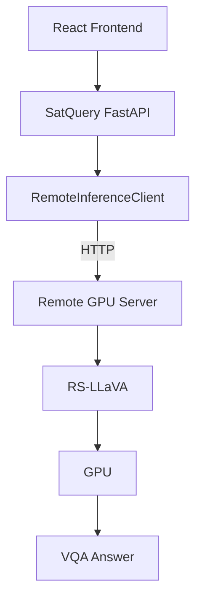

# Remote GPU Setup for RS-LLaVA

This document outlines the expected remote server requirements and architectural setup for connecting the SatQuery AI system to a real RS-LLaVA VQA and Captioning model.

## 1. System Separation

### LOCAL MACHINE
- **Role**: Runs the SatQuery FastAPI backend and the React Frontend.
- **Constraints**: Does not require the heavy RS-LLaVA model. Does not require a local GPU or CUDA.

### REMOTE GPU SERVER
- **Role**: Runs RS-LLaVA, provides the HTTP inference API, and performs heavy GPU inference.
- **Requirements**:
  - Linux environment (e.g., Ubuntu 20.04/22.04)
  - NVIDIA GPU with CUDA support
  - Python environment
  - RS-LLaVA repository and model weights
  - An active inference server (like vLLM or FastAPI) exposing an HTTP endpoint

> **Note**: Satellite imagery retrieval (via STAC/Earth Search) is handled entirely by the **SatQuery FastAPI backend**. The remote GPU server should *only* focus on loading the RS-LLaVA model and processing the image + question provided in the inference payload. It does not need internet access to download satellite imagery itself.

## 2. Architecture Diagram



## 3. Configuration Example

To connect the SatQuery local machine to the remote GPU server, configure the `.env` file in the `backend/` directory:

```env
RS_VQA_MODEL_NAME=BigData-KSU/RS-llava-v1.5-7b-LoRA
RS_VQA_ENDPOINT=http://<REMOTE_GPU_SERVER_IP>:<PORT>/api/infer
RS_VQA_API_KEY=<YOUR_API_KEY_IF_ANY>
RS_VQA_TIMEOUT=120
```

## 4. Before Model Installation Checklist

Ensure the Remote GPU Server meets the following conditions before attempting to load RS-LLaVA:
- [ ] **GPU Available**: Verify with `nvidia-smi`
- [ ] **NVIDIA Driver Available**: Verify driver installation
- [ ] **CUDA Available**: Verify `nvcc --version`
- [ ] **Python Version**: Ensure Python 3.10+
- [ ] **Sufficient Disk Space**: Ensure at least ~40GB free for 7B model weights
- [ ] **Sufficient GPU VRAM**: Ensure at least 16GB-24GB VRAM (depending on quantization)
- [ ] **Inference Server Port Available**: Ensure firewall/security groups permit inbound traffic on the designated port.

## 5. Next Steps

The next step will be securely provisioning and setting up the actual RS-LLaVA inference server on the remote GPU machine, pulling the model weights, and serving the endpoint. No heavy dependencies or model weights are currently installed locally.
